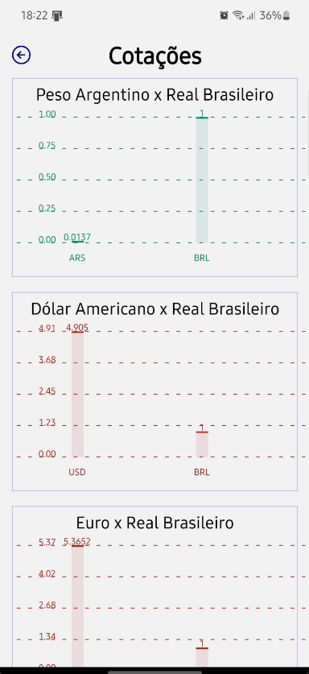

# Money

A tela `Money` exibe informações sobre as cotações de moedas em relação ao Real (BRL).  
Utiliza a classe `ApiRequests` para fazer requisições à API e obter dados atualizados sobre as cotações.  
As cotações de três moedas (Dólar, Euro e Peso Argentino) são exibidas em gráficos usando o componente `MoneysGraph`.

## Principais Características

1. **Cotações de Moedas:**
   - Utiliza a classe `ApiRequests` para obter dados das cotações de moedas.
   - As moedas exibidas são Dólar (USD), Euro (EUR) e Peso Argentino (ARS).

2. **Gráficos de Cotação:**
   - Para cada moeda, exibe um gráfico utilizando o componente `MoneysGraph`.
   - Os gráficos apresentam a relação da moeda com o Real (BRL).
   - Os dados incluem a taxa de câmbio de compra (`ask`) e uma constante para referência.

3. **Componente MoneysGraph:**
   - O componente `MoneysGraph` é utilizado para exibir os gráficos de barras das cotações de moedas.
   - Os dados do gráfico são passados como propriedades (`bardata` e `name`).

4. **Botão de Retorno à Tela Inicial:**
   - Inclui um botão de retorno à tela inicial (Home) para facilitar a navegação.
   - O botão utiliza o ícone de seta para trás da biblioteca `Ionicons`.

5. **Estilo Responsivo:**
   - Utiliza estilos que proporcionam uma boa aparência e organização na tela.
   - Adota margens e espaçamentos para melhorar a legibilidade e usabilidade.

## Exemplo de Uso

```jsx
<Money />
```

## Observações

- A tela utiliza o contexto de carregamento (`useLoading`) para exibir e ocultar indicadores de carregamento durante a obtenção dos dados.
- Os gráficos de cotação são exibidos usando o componente `MoneysGraph`, que provavelmente é importado de um arquivo separado.
- A tela inclui uma rolagem (`ScrollView`) para acomodar os gráficos, permitindo a visualização de todas as informações em uma única página.
- As cotações de moedas são obtidas no momento da renderização da tela, garantindo informações atualizadas.


